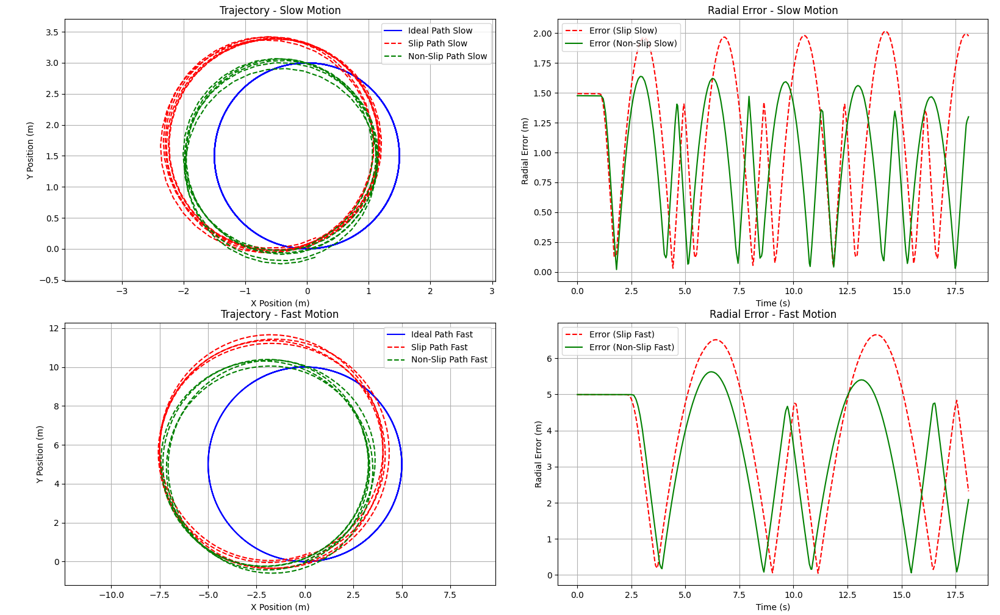
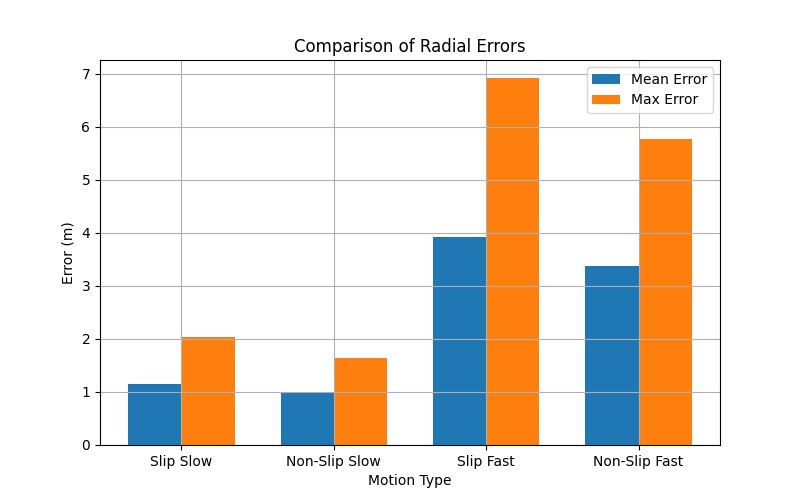
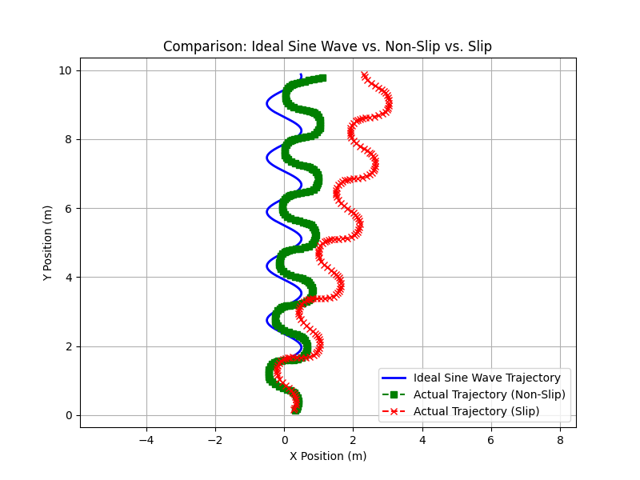
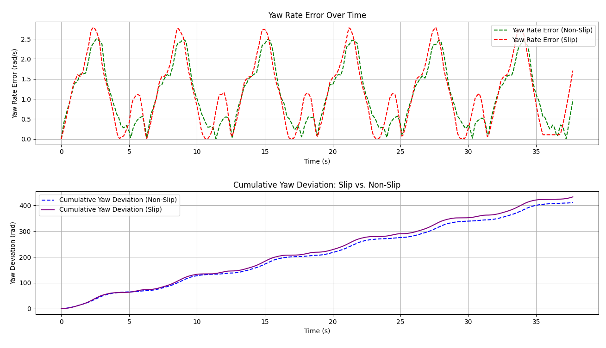
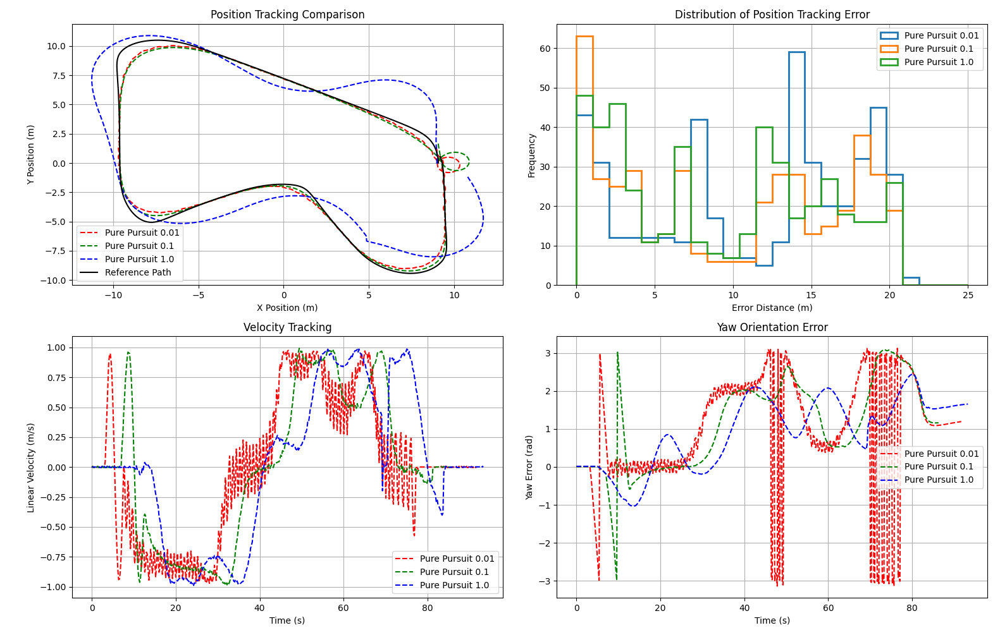
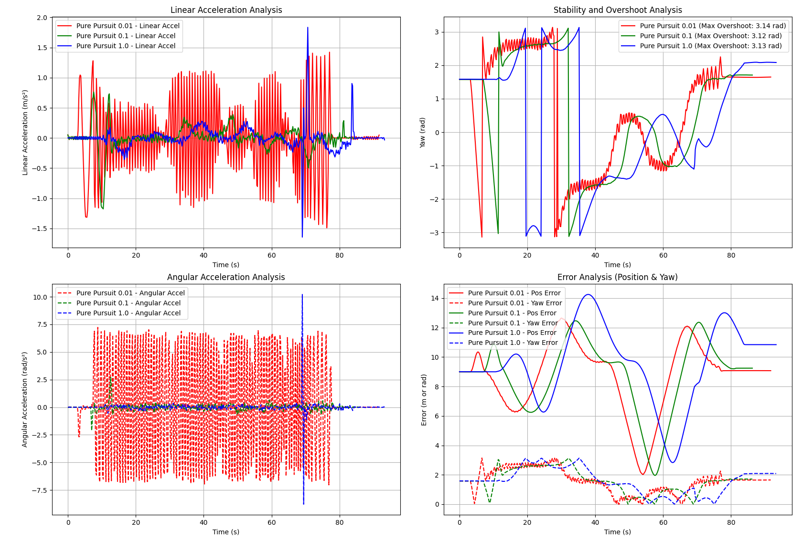
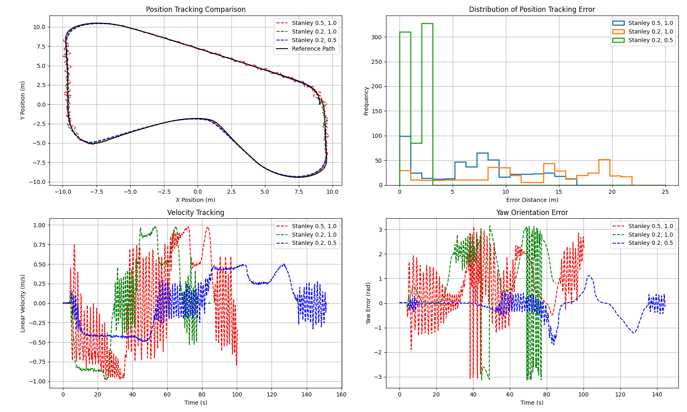
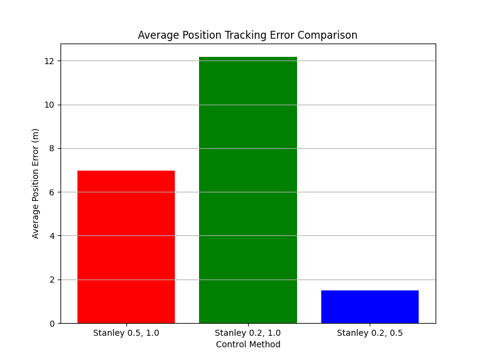
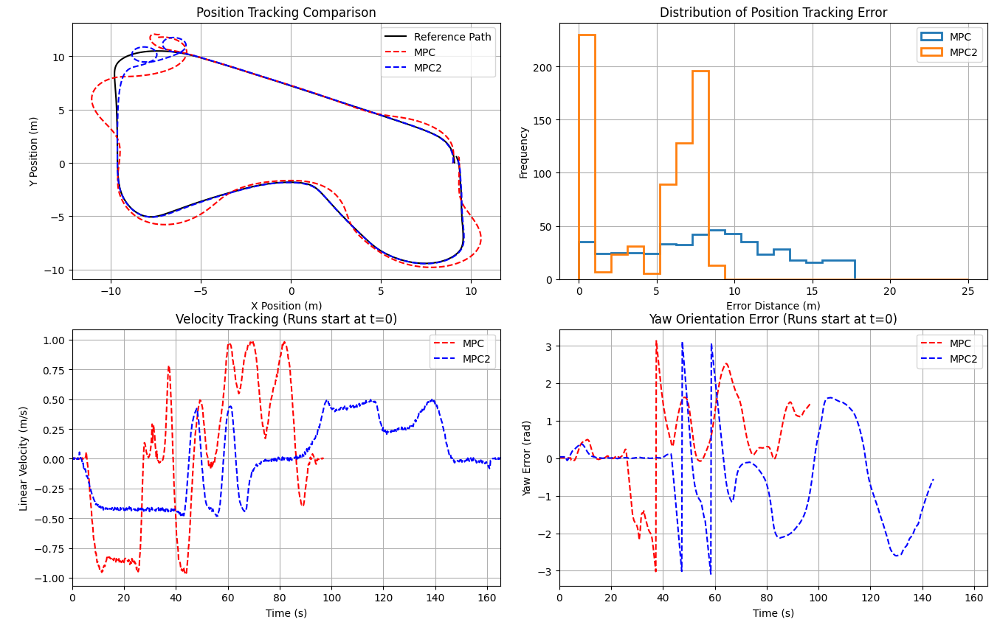

# Lab1_Mobile
## **System overview**

## **How to use**

git clone the repository 

```
git clone https://github.com/Saifa36622/Lab1_Mobile.git

```

then build and source the directory 

```
colcon build && source install/setup.bash

```

to run simulation with gazebo ground truth 


```
ros2 launch lab1_robot_gazebo sim.launch.py

```
#### Lab1.1

- IK run controller with bicycle model

```
ros2 run lab1_robot_description controller.py
```

- IK run controller withnon-slip model

```
ros2 run lab1_robot_description controller2.py
```

- FK run 3 type odom that can visualize in RVIZ

```
ros2 launch lab1_robot_description odom.launch.py

```
and to control by keyboard use
```
ros2 run teleop_twist_keyboard teleop_twist_keyboard
```


#### Lab1.2

run sim with ground truth and no-slip controller
``` 
ros2 launch lab1_robot_gazebo sim_controller.launch.py
```
and to select Path tracking control method 
- Pure Pursuit controller 
```
ros2 run lab1_robot_description Pure_pursuit.py
```
- Stanley controller 
```
ros2 run lab1_robot_description Stanley.py
```
 - MPC controller 
 ```
ros2 run lab1_robot_description MPC.py
 ```
#### Lab1.3

run sim with ground truth and no-slip controller and EKF (visualize odom, EKF and GPS data in rviz)

````
ros2 launch lab1_robot_gazebo sim_EKF.launch.py
````

run path tracking with customize odom we can use parameter "ground_truth", "double_track", "single_track", "yaw_rate" such as 

```
ros2 run lab1_robot_description Pure_pursuit.py --ros-args --param odom:="double_track"
```
```
ros2 run lab1_robot_description MPC.py --ros-args --param odom:="ground_truth"
```

```
ros2 run lab1_robot_description Stanley.py --ros-args --param odom:="double_track"
```
## **Validation**

### Lab1.1

#### Inverse Kinematics

In this part we calculate wheel speed from the linear velocity and omega input with 2 method 

- **Basic Model or Bicycle model**
    - Calculate the steering angle (δ) from yaw rate / velocity

$$\delta = \arctan \left( \frac{L \Omega_z}{v} \right)$$

- where: <br>
  - `L` is the wheelbase,
  - `Ωz` is the yaw rate,
  - `v` is the velocity.

- **No Slip condition constraints**
   - Calculate the steering angle (δ) from 

        - Inside wheel angle
$$
\delta_inside = \tan^{-1} \left( \frac{WB \tan(\delta_{Ack})}{WB + 0.5 TW \tan(\delta_{Ack})} \right)
$$ 
<br> 

- Outside wheel angle

<br>

$$
\delta_outside = \tan^{-1} \left( \frac{WB \tan(\delta_{Ack})}{WB - 0.5 TW \tan(\delta_{Ack})} \right)
$$

where:
- $WB$ is the **wheelbase** (distance between front and rear axles),
- $TW$ is the **track width** (distance between the left and right wheels),

when 
- Right turn

  - Outside angle, $\delta_outside$, is left wheel angle $\delta_L$

  - Inside angle, $\delta_inside$, is right wheel angle $\delta_R$

- Left turn <br>
  - Outside angle, $\delta_outside$, is left wheel angle $\delta_R$

  - Inside angle, $\delta_inside$, is right wheel angle $\delta_L$

To compare and validate result, we use pure pursuit path tracking with different speed and plot the results to compare:

- position
- omega and yaw

So the we will validate with run in 2 shape 


##### Circle shape 

we will run in 2 speed 

 - Slow 
   - linear velocity = 1.5 m/s
   - angular velocity  = 1.0 rad/s
- fast 
  - linear velocity = 2.5 m/s
   - angular velocity  = 0.5 rad/s


To validate the bicycle model and non-slip assumption, we conducted an experiment in which the system was commanded to follow a circular trajectory by maintaining a constant linear velocity and constant angular velocity to validate the position in this situation 

A result is show as following

 

and we can plot the position error as follow



###### Position Tracking Error Summary

| Scenario         | Mean Error (m) | Max Error (m) |
|-----------------|---------------|--------------|
| Slip Slow      | 1.1596        | 2.0333       |
| Non-Slip Slow  | 0.9721        | 1.6384       |
| Slip Fast      | 3.9207        | 6.9164       |
| Non-Slip Fast  | 3.3777        | 5.7663       |


The graph indicates that, at the same speed, the non-slip model demonstrates better trajectory tracking than the slip model, which exhibits significantly higher radial error. Additionally, as speed increases, the amount of error also rises, as shown in the bar graph. This suggests that velocity constraints significantly impact position accuracy and trajectory tracking for both models. The effect is particularly show in the slip model, where higher speeds result in substantial radial error, leading to greater deviations from the desired path.

##### Sin wave

To validate the bicycle model and non-slip assumption, we conducted an experiment in which the system was commanded to follow a sinusoidal trajectory by maintaining a constant linear velocity while applying a periodic steering input to evaluate its positional accuracy under these conditions.

 

and we can plot the position error as follow



from the graph indicate that slip makes it much harder for the bicycle model to stay on track and control its direction. The slip model has bigger yaw errors, which add up over time, causing it to drift further from the intended path. This is especially clear in the wavy (sinusoidal) path, where the slip model struggles to follow the ideal route and moves too far off course. On the other hand, the non-slip model keeps better control and stays closer to the planned path. This means that reducing slip is important for better accuracy, especially at higher speeds where errors grow quickly.

#### Conclusion 

The analysis shows that the non-slip model performs better in both trajectory tracking and direction control compared to the slip model. At the same speed, the slip model has a much higher radial error and struggles to stay on the desired path. As speed increases, errors become larger for both models, but the slip model is affected the most, showing significant deviations. The yaw rate error and cumulative yaw deviation further confirm that slip leads to long-term drift, making it harder to maintain stability, especially on curved paths. Overall, reducing slip is key to improving accuracy, especially at higher speeds, where errors grow rapidly and make precise control more difficult.

The reason the Bicycle model show the worse result becasue The bicycle model does not work well under slip conditions because it assumes perfect traction and ignores complex tire dynamics ,It going to become inaccurate when dealing with high slip, sharp turns, or low-friction surfaces and that is all the constrain we going to face in this project ,**So for the path tracking controler we will choose non-slip model as our wheel velocity controller**
#### Forward Kinematics

In this part we calculate odometry from forward Kinematics with 3 method
- **Double Track:** 
    - Calculate linear velocity ($v$) from average speed of 2 rear wheel.
    $$v = \frac{v_{RR} + v_{RL}}{2}$$

    - Calculate angular velocity (${\omega}$) from speed difference between 2 rear wheel.
    $${\omega} = \frac{v_{RR} - v_{RL}}{Track Width}$$
- **Single Track:** 
    - Calculate linear velocity ($v$) from average speed of 2 rear wheel.
    $$v = \frac{v_{RR} + v_{RL}}{2}$$ 
    - Calculate angular velocity (${\omega}$) from Steering angle (${\delta}$).
    $${\omega} = \frac{v}{Wheelbase} tan({\delta})$$
- **Yaw Rate:** 
    - Calculate linear velocity ($v$) from average speed of 2 rear wheel.
    $$v = \frac{v_{RR} + v_{RL}}{2}$$ 
    - Calculate angular velocity (${\omega}$) from IMU sensor.
    $${\omega} = {\omega_{IMU}}$$

To compare and validate result, we use pure pursuit path tracking with different speed and plot the results to compare:
- position
- orientation
- angular velocity
- linear velocity

The results for each method are shown in the following graphs:


From graph we can see linear velocity and angular velocity trends match with ground truth but there are some error.
This validates that the forward kinematics equations used in each model are correct.

To better understand the error characteristics, we plot error distributions and compare results at two different speeds
- Double track
 

- Single track
 

- Yaw rate
 


From distribution graph we can conclusion that
- Double track: Highest noise, especially in angular velocity, which increases with speed. As we can see when comparing position graphs at different speeds.
- Single tarack: Highest mean error.
- Yaw rate: Lowest error and noise among the three methods.

And to analyze how steering angle affects error, we control the robot in a circular path and plot the results.


From these graph we can see different in angular velocity error in single track model and if we plot distribution we will get


So we can conclude that single track will have more bias at higher steering angles.

##### Conclusion
- Double Track:
    - Error is mainly due to variance.
    - Variance increases with speed, causing higher noise at higher speeds.
    - Because Double track calculate from wheel speed so double track will more sensitive to robot speed

- Single Track:
    - Error is mainly due to bias.
    - Bias increases with higher steering angles.
    - Because Single track calculate from steering angle so single track will more sensitive to steering angle.

- Yaw Rate:
    - Has the least error.
    - Error increases if IMU noise is high.

### Lab1.2
The selected algorithm is 
 - Pure Pursuit
    - **Pro** : This control method are directly uses a look-ahead distance and the path to compute steering commands and pretty straightforward to implement
    - **Con**: At high speeds or on sharp curves, it can exhibit lag or large tracking errors and requires carefully selecting a look-ahead distance. Too short → unstable; too long → Turn too fast or not tracking the path
 - Stanley
   -  **Pro** : This control method are directly measures angular error and lateral error
   - **Con**: Like other geometry-based methods, it does not inherently account for tire slip anx require careful parameter selection; incorrect gains can lead non-opimal path tracking 
 - MPC
   -  **Pro** : This control method can explicitly incorporate actuator limits, slip angles, or other physical constraints and considers future states over a prediction horizon, which helps anticipate sharp curves or sudden changes also can integrate dynamic vehicle models, cost functions for safety, comfort, efficiency, etc.
   - **Con**: Requires solving an optimization problem at each time step and complex implementation <br>

why not PID : <br>
 while PID is easy to implement and understand but this control method does not inherently account for curvature or vehicle kinematics also a single set of gains may not perform well under different speeds or tight turns .So in this constraint **PID might not be the optimal control method** 

#### Pure Pursuit

The steering angle ${\delta}$ is calculated using the **Pure Pursuit** formula:

$${\delta} = \arctan \left( \frac{2L \sin(\alpha)}{l_d} \right)$$

where:
- ${L}$ is the **wheelbase** of the vehicle,
- ${\alpha}$ is the **angle between the look-ahead point and the vehicle's heading**,
- ${l_d}$ is the **look-ahead distance**.

This equation is fundamental to **Pure Pursuit control**, which adjusts the steering based on a target waypoint ahead of the vehicle.

In this validation we use 3 variable of look-ahead distance as follows **[0.01 ,0.1,1]** and use constant speed at **1.0 m/s**

So the result as follows



and if we plot out the error 



from the graph indicate 
- **Path Tracking and Position Error**
  - Pure Pursuit 0.01 (red) follows the path well but has small oscillations.
  - Pure Pursuit 0.1 (green) is smoother and closer to the reference path.
  - Pure Pursuit 1.0 (blue) struggles to stay on track, especially in sharp turns.
  - **Position error is smallest for 0.1, while 1.0 has the largest errors, meaning it drifts more from the target path.**

- **Speed and Acceleration Stability**
  - Pure Pursuit 0.01 has unstable speed, with high acceleration spikes,that causing jerky motion.
  - Pure Pursuit 0.1 keeping speed steady and acceleration under control.
  - Pure Pursuit 1.0 is unstable, with sudden speed jumps and inconsistent movement.
- **Orientation and Overshoot**
   - Yaw error is lowest for 0.1, meaning it keeps the correct direction better.
   - 0.01 and 1.0 have big orientation swings, making them harder to control.
   - Overshoot is worst in 0.01, meaning it reacts too aggressively.

##### Conclusion

The analysis shows that Pure Pursuit 0.1 gives the best balance between accuracy, stability, and smooth movement, while 0.01 is too reactive and 1.0 is too unresponsive, all running at a constant speed of 1 m/s. The main reason is the look-ahead distance—a small value (0.01) reacts too fast, making constant sharp corrections, causing high acceleration spikes and unstable motion. On the other hand, a large look-ahead distance (1.0) looks too far ahead, making the vehicle cut corners and struggle with sharp turns, leading to big tracking errors. Even though all setups move at 1 m/s, 0.01 keeps adjusting too much, making the motion shaky, while 1.0 doesn’t respond well enough, leading to drifting. The medium look-ahead distance (0.1) works best, keeping the movement smooth and accurate with fewer errors. This shows that even at a constant speed, **tuning the look-ahead distance is key to getting both accuracy and stability**. However, if the speed changes, the look-ahead distance also needs to be adjusted to keep the same level of accuracy and stability

#### Stanley 

The steering angle ${\delta}$ is calculated using the **Stanley Controller** formula:

$${\delta(t)} = {\theta_e(t) + \tan^{-1} \left( \frac{k e_{fa}(t)}{v_x(t)} \right)}$$

where:
- ${\theta_e(t)}$ is the **heading error** at time \( t \),
- ${k}$ is the **tuning gain** that affects lateral error correction,
- ${e_{fa}(t)}$ is the **lateral error** (perpendicular distance from the reference path),
- ${v_x(t)}$ is the **vehicle's longitudinal velocity**.

This equation is fundamental to **Stanley Control**, which corrects both heading and lateral errors for accurate path tracking.

In this validation for this control method that have velocity in the equation we will fine tune the 
variablew as follows 

 - ${k}$ = 0.2 , linear_speed = 0.5
 - ${k}$ = 0.2 , linear_speed = 1.0
 - ${k}$ = 0.5 , linear_speed = 1.0

 So the result as follows

 

 and we plot out the error as a graph as follow 

 

 
from the graph indicate 

 - **Position Tracking and Error**
   - Stanley with k =  0.2,linear_vel =  0.5 (blue) achieves the best tracking, closely following the reference path with the lowest average position error
   - Higher speeds make it harder to track accurately, as seen in Stanley 0.2, 1.0’s large position error distribution, where many errors exceed 10m.
 - **Effect of Gain (k) on Stability and Overshoot**
    - Higher k values (0.5) respond faster but can cause overshoot and oscillations if not well-tuned to sync with the linear_vel
    - Lower k values (0.2) are smoother, reducing excessive corrections, but may respond too slowly at high speeds.

 - **Velocity Tracking and Yaw Error**
   - Yaw error follows a similar trend, where higher speed settings (1.0 m/s) cause larger yaw deviations, making orientation control harder.
   - At linear_vel = 1 , Lower k values (0.2) are smoother, reducing excessive corrections, but may respond too slowly at high speeds. but k gain = 0.5 also struggles with maintaining a steady velocity, as high gain causes rapid adjustments.

##### Conclusion

The analysis shows that Stanley with k = 0.2, linear velocity = 0.5 m/s (blue) provides the best balance, achieving low position error, stable yaw, and smooth velocity tracking. In contrast, Stanley with k = 0.5, v = 1.0 (red) and k = 0.2, v = 1.0 (green) struggle with higher errors, instability, and oscillations. The reason for this outcome lies in the interaction between gain (k) and speed—a higher k (0.5) reacts more aggressively, leading to overshoot and rapid corrections, while a lower k (0.2) at high speed (1.0 m/s) lacks responsiveness, causing large tracking deviations. Additionally, at higher speeds, the controller has less time to adjust, making errors larger, especially with a low k value that cannot correct quickly enough. Meanwhile, Stanley k = 0.2, v = 0.5 (blue) strikes the optimal balance, where low speed gives the controller enough time to adjust smoothly, and a moderate gain (0.2) prevents excessive oscillations, leading to precise and stable tracking. This confirms that higher speeds require fine-tuning of k and additional predictive adjustments to maintain accuracy and stability.

#### MPC (model predictive control) 

##### 1. Vehicle Motion Model (Ackermann Kinematics)

The kinematic equations for an Ackermann-drive vehicle are:

$$
\dot{{x}} = {v} \cos({\theta}), \quad
\dot{{y}} = {v} \sin({\theta}), \quad
\dot{{\theta}} = \frac{{v}}{{L}} \tan({\delta}), \quad
\dot{{v}} = {a}
$$

where:
- ${x}$, ${y}$ are the vehicle’s position,
- ${\theta}$ is its heading angle,
- ${v}$ is its forward velocity,
- ${\delta}$ is the steering angle,
- ${a}$ is the longitudinal acceleration,
- ${L}$ is the wheelbase.

##### 2. Linearized State-Space Model for MPC

We define our state and input vectors as:

$$
{\mathbf{x}} = 
\begin{bmatrix}
{x} \\
{y} \\
{\theta} \\
{v}
\end{bmatrix}
,\quad
{\mathbf{u}} =
\begin{bmatrix}
{a} \\
{\delta}
\end{bmatrix}.
$$

A discretized linear model typically has the form:

$$
{\mathbf{x}}_{k+1} = {A}\,{\mathbf{x}}_{k} + {B}\,{\mathbf{u}}_{k},
$$

where ${A}$ and ${B}$ come from linearizing the above kinematic equations around a nominal operating point (e.g. ${\delta_0}$, ${v_0}$).

##### 3. MPC Optimization

At every time step, MPC solves:

$$
\min_{\{{\mathbf{u}}_0,\dots,{\mathbf{u}}_{N-1}\}}
\sum_{k=0}^{N-1} \Bigl[
({\mathbf{x}}_{k} - {\mathbf{x}}_{k}^{\text{ref}})^T {Q} ({\mathbf{x}}_{k} - {\mathbf{x}}_{k}^{\text{ref}})
+ {\mathbf{u}}_{k}^T {R} {\mathbf{u}}_{k}
\Bigr]
+ ({\mathbf{x}}_{N} - {\mathbf{x}}_{N}^{\text{ref}})^T {P} ({\mathbf{x}}_{N} - {\mathbf{x}}_{N}^{\text{ref}})
$$

subject to:

$$
{\mathbf{x}}_{k+1} = {A}\,{\mathbf{x}}_{k} + {B}\,{\mathbf{u}}_{k},
$$

and constraints such as:

$$
-{\delta}_{\max} \le {\delta}_{k} \le {\delta}_{\max}, 
\quad {a}_{\min} \le {a}_{k} \le {a}_{\max}, 
\quad 0 \le {v}_{k} \le {v}_{\max}.
$$

Only the first control input ${\mathbf{u}}_{0}$ is applied each cycle, then the horizon “slides” forward.

---

**Additional Notes on the Cost Function and Weighting Matrices**

1. **Stage Cost:**

   $$
   ({\mathbf{x}}_{k} - {\mathbf{x}}_{k}^{\text{ref}})^T Q ({\mathbf{x}}_{k} - {\mathbf{x}}_{k}^{\text{ref}})
   + {\mathbf{u}}_{k}^T R {\mathbf{u}}_{k}
   $$

   This term penalizes deviations from the desired trajectory via \(Q\) and large control efforts via \(R\).

2. **Terminal Cost:**

   $$
   ({\mathbf{x}}_{N} - {\mathbf{x}}_{N}^{\text{ref}})^T P ({\mathbf{x}}_{N} - {\mathbf{x}}_{N}^{\text{ref}})
   $$

   A final penalty on the state at the end of the horizon, encouraging the MPC to consider long-term performance. The matrix \(P\) is often chosen as the solution to a Riccati equation for an infinite-horizon LQR to ensure good closed-loop stability.

3. **Weighting Matrices \((Q,R,P)\):**

   - \(Q \succeq 0\) penalizes state tracking errors.
   - \(R \succ 0\) penalizes excessive control input magnitudes.
   - \(P \succeq 0\) shapes the terminal penalty on the final state.
   - Optionally, an additional matrix \(R_d\) can penalize rapid changes in control:
   
     $$
     (\Delta \mathbf{u}_k)^T R_d (\Delta \mathbf{u}_k),
     \quad \text{where} \ \Delta \mathbf{u}_k = \mathbf{u}_k - \mathbf{u}_{k-1}.
     $$

4. **Receding Horizon Strategy:**
   - After computing the optimal control sequence \(\{\mathbf{u}_0, \dots, \mathbf{u}_{N-1}\}\), only \(\mathbf{u}_0\) is applied to the system.
   - At the next time step, the horizon shifts forward by one, and the optimization is solved again using the updated state \(\mathbf{x}_1\). 

---




from the graph indicate that 

### Lab1.3
In this part we use Extended Kalman filter (EKF) to estimate position and orientation from odometry data and GPS data

**Define variable**
- state vector 
```math
x = \begin{bmatrix}
    p_x \\
    p_y \\
    {\phi}
\end{bmatrix}
```
- input vector 
```math
u = \begin{bmatrix}
    v\\
    {\omega}
\end{bmatrix}
```
- Prediction Model:
    - $p_{x_{k+1}} = p_{x_{k}} + v_k cos{\phi}Δt$
    - $p_{y_{k+1}} = p_{y_{k}} + v_k sin{\phi}Δt$
    - $\phi_{k+1} = \phi_{k} + \omega_k Δt$
- State Transition Matrix (F)
```math
F = \frac{\partial f(x_t,u_t)}{\partial x}|_{x_t,u_t} =\begin{bmatrix}
\frac{\partial p_{x_{k+1}}}{\partial p_{x_{k}}} & \frac{\partial p_{x_{k+1}}}{\partial p_{y_{k}}} & \frac{\partial p_{x_{k+1}}}{\partial {\phi}_{k}} \\
\frac{\partial p_{y_{k+1}}}{\partial p_{x_{k}}} & \frac{\partial p_{y_{k+1}}}{\partial p_{y_{k}}} & \frac{\partial p_{y_{k+1}}}{\partial {\phi}_{k}} \\
\frac{\partial {\phi}_{k+1}}{\partial p_{x_{k}}} & \frac{\partial {\phi}_{k+1}}{\partial p_{y_{k}}} & \frac{\partial {\phi}_{k+1}}{\partial {\phi}_{k}}
\end{bmatrix} = \begin{bmatrix}
    1 & 0 & -v_k sin{\phi}Δt \\
    0 & 1 & v_k cos{\phi}Δt \\
    0 & 0 & 1
\end{bmatrix}
```
- Measurement Matrix (H)
```math
H = \begin{bmatrix}
1 & 0 & 0 \\
0 & 1 & 0
\end{bmatrix}
```

**Prediction step**
1. Predicted state estimate
    $\hat{x} = f(x,u)$
2. Predicted error covarience
    $\hat{P} = FPF^T+Q$
    (Q is process noise covarience)

**Update step**
1. Innovation residual
    $y = z-h(\hat{x})$
2. Find Kalman gain
    $K = \hat{P}H^T(H\hat{P}H^T+R)^{-1}$
3. Corrected state estimate
    $x = \hat{x} + Ky$
3. Corrected estimate covarience
    $P = (I-KH)\hat{P}$

In the first step we use S.D. from noise that calculate and GPS noise to define R and Q value

- Q process noise covarience
```math
Q = \begin{bmatrix}
{\sigma}_x & 0 & 0 \\
0 & {\sigma}_y & 0 \\
0 & 0 & {\sigma}_{\phi}
\end{bmatrix}
```
and
$\sigma_x = \sigma_v$, 
$\sigma_y = \sigma_v$, 
$\sigma_\phi = \sigma_\omega$
(we have calculate $\sigma_v$ and $\sigma_\omega$ in part 1 that is $S.D.^2$)

- R sensor noise covarience
```math
R = \begin{bmatrix}
{\sigma}_{GPS} & 0\\
    0 & {\sigma}_{GPS}
\end{bmatrix}
```

For Q and R = varience above we get a trajectory graph below


from trajectory calculate error compare to ground truth is equal 
|Odom Model|Mean Pos. Error (m)|Mean Yaw Error (rad)|
|---|---|---|
|Double Track|0.08430|0.09219|
|Single Track|0.08436|0.06741|
|Yaw Rate|0.08069|0.05560|

After this we start to tune R value and observe error trend
- Double Track

|R value (in diagonal of 2x2 matrix)|Mean Pos. Error (m)|Mean Yaw Error (rad)|
|---|---|---|
|0.01|0.08430|0.09219|
|0.05|0.08487|0.05151
|0.1|0.05384|0.04979
|0.2|0.14942|0.05347

- Single Track

|R value (in diagonal of 2x2 matrix)|Mean Pos. Error (m)|Mean Yaw Error (rad)|
|---|---|---|
0.01|0.08436|0.06741
0.05|0.08545|0.04559
0.1|0.04687|0.04199
0.2|0.17527|0.05911

- Yaw Rate

|R value (in diagonal of 2x2 matrix)|Mean Pos. Error (m)|Mean Yaw Error (rad)|
|---|---|---|
|0.01|0.08069|0.05560
|0.05|0.06835|0.03477
|0.1|0.05211|0.02966
|0.2|0.17445|0.04295

from error value the best R value (in diagonal of 2x2 matrix) is 0.1

After this we start to tune Q value and observe error trend by adjust the S.D. input given to calculate varience
- Double Track

Q value adjust|Mean Pos. Error (m)|Mean Yaw Error (rad)
|---|---|---|
+0.01|0.11090|0.09884
-0.01|0.05274|0.05046
+0|0.05384|0.04979

- Single Track

Q value adjust|Mean Pos. Error (m)|Mean Yaw Error (rad)
|---|---|---|
+0.01|0.12058|0.09179
-0.01|0.04776|0.04391
+0|0.04687|0.04199

- Yaw Rate

Q value adjust|Mean Pos. Error (m)|Mean Yaw Error (rad)
|---|---|---|
+0.01|0.10258|0.07567
-0.01|0.04213|0.02654
+0|0.05211|0.02966

from error value the best Q value adjustment is +0 as we see +0.01 make more error and -0.01 can make some error value decrease and some increase that did not show significant differences, So both +0 and -0.01 is mostly same value.

##### Conclusion
- We can initialize Q and R based on sensor variance.
- Fine-tuning can improve accuracy, with R=0.1 and Q=initial variance being the best settings for this experiment.
- From the results, we can interpret the effect of tuning R and Q as follows:
    - Higher R → Trusts model more, ignores sensor updates
    - Lower Q → Assumes the model is more accurate
    - Since Q=0 and R=0.1 performed best, this suggests that the EKF relies more on odometry compared to the initial settings in this experiment.

**Replace Odometry from Ground truth by Odometry from EKF in Path Tracking Controller**

In this part, we use the Pure Pursuit path tracking algorithm and compare the EKF-estimated position to the actual robot position


From the graph, we observe some differences between using ground truth and EKF data and can make conclusion:
- EKF data still contains some noise due to sensor fusion and process noise.
- Robot behavior:
    - When the EKF estimates the robot is to the right of its actual position, the controller corrects it to the left.
    - When the EKF estimates the robot is to the left, the controller corrects it to the right.
    - This continuous correction causes the robot to exhibit a shaking motion along the path.
