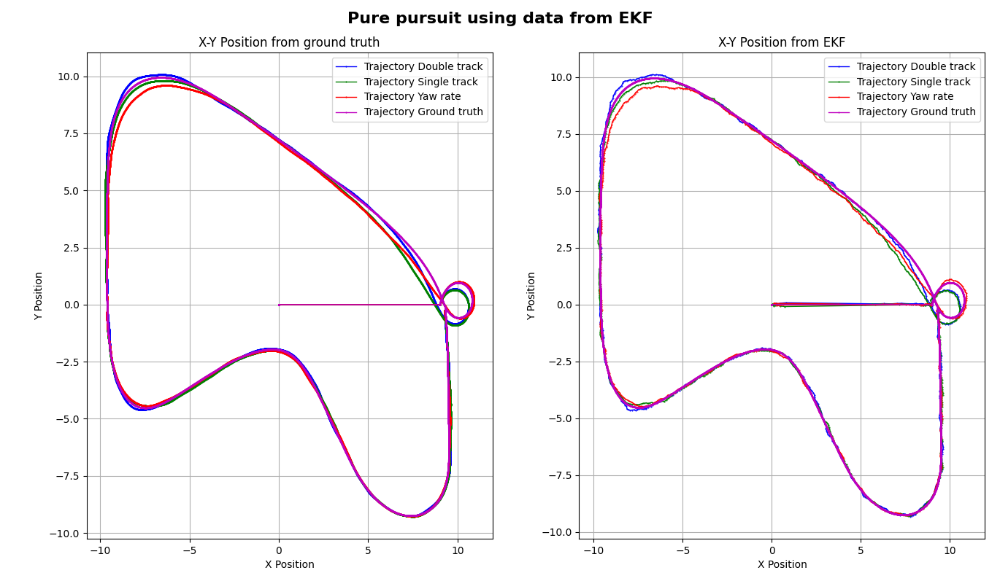

# Lab1_Mobile
 ## Lab1.1
### Forward Kinematics

In this part we calculate odometry from forward Kinematics with 3 method
- **Double Track:** 
    - Calculate linear velocity ($v$) from average speed of 2 rear wheel.
    $$v = \frac{v_{RR} + v_{RL}}{2}$$

    - Calculate angular velocity (${\omega}$) from speed difference between 2 rear wheel.
    $${\omega} = \frac{v_{RR} - v_{RL}}{Track Width}$$
- **Single Track:** 
    - Calculate linear velocity ($v$) from average speed of 2 rear wheel.
    $$v = \frac{v_{RR} + v_{RL}}{2}$$ 
    - Calculate angular velocity (${\omega}$) from Steering angle (${\delta}$).
    $${\omega} = \frac{v}{Wheelbase} tan({\delta})$$
- **Yaw Rate:** 
    - Calculate linear velocity ($v$) from average speed of 2 rear wheel.
    $$v = \frac{v_{RR} + v_{RL}}{2}$$ 
    - Calculate angular velocity (${\omega}$) from IMU sensor.
    $${\omega} = {\omega_{IMU}}$$

To compare and validate result, we use pure pursuit path tracking with different speed and plot the results to compare:
- position
- orientation
- angular velocity
- linear velocity

The results for each method are shown in the following graphs:


From graph we can see linear velocity and angular velocity trends match with ground truth but there are some error.
This validates that the forward kinematics equations used in each model are correct.

To better understand the error characteristics, we plot error distributions and compare results at two different speeds
- Double track
 

- Single track
 

- Yaw rate
 


From distribution graph we can conclusion that
- Double track: Highest noise, especially in angular velocity, which increases with speed. As we can see when comparing position graphs at different speeds.
- Single tarack: Highest mean error.
- Yaw rate: Lowest error and noise among the three methods.

And to analyze how steering angle affects error, we control the robot in a circular path and plot the results.


From these graph we can see different in angular velocity error in single track model and if we plot distribution we will get


So we can conclude that single track will have more bias at higher steering angles.

#### Conclusion
- Double Track:
    - Error is mainly due to variance.
    - Variance increases with speed, causing higher noise at higher speeds.
    - Because Double track calculate from wheel speed so double track will more sensitive to robot speed

- Single Track:
    - Error is mainly due to bias.
    - Bias increases with higher steering angles.
    - Because Single track calculate from steering angle so single track will more sensitive to steering angle.

- Yaw Rate:
    - Has the least error.
    - Error increases if IMU noise is high.


## Lab1.3
In this part we use Extended Kalman filter (EKF) to estimate position and orientation from odometry data and GPS data

**Define variable**
- state vector 
```math
x = \begin{bmatrix}
    p_x \\
    p_y \\
    {\phi}
\end{bmatrix}
```
- input vector 
```math
u = \begin{bmatrix}
    v\\
    {\omega}
\end{bmatrix}
```
- Prediction Model:
    - $p_{x_{k+1}} = p_{x_{k}} + v_k cos{\phi}Δt$
    - $p_{y_{k+1}} = p_{y_{k}} + v_k sin{\phi}Δt$
    - $\phi_{k+1} = \phi_{k} + \omega_k Δt$
- State Transition Matrix (F)
```math
F = \frac{\partial f(x_t,u_t)}{\partial x}|_{x_t,u_t} =\begin{bmatrix}
\frac{\partial p_{x_{k+1}}}{\partial p_{x_{k}}} & \frac{\partial p_{x_{k+1}}}{\partial p_{y_{k}}} & \frac{\partial p_{x_{k+1}}}{\partial {\phi}_{k}} \\
\frac{\partial p_{y_{k+1}}}{\partial p_{x_{k}}} & \frac{\partial p_{y_{k+1}}}{\partial p_{y_{k}}} & \frac{\partial p_{y_{k+1}}}{\partial {\phi}_{k}} \\
\frac{\partial {\phi}_{k+1}}{\partial p_{x_{k}}} & \frac{\partial {\phi}_{k+1}}{\partial p_{y_{k}}} & \frac{\partial {\phi}_{k+1}}{\partial {\phi}_{k}}
\end{bmatrix} = \begin{bmatrix}
    1 & 0 & -v_k sin{\phi}Δt \\
    0 & 1 & v_k cos{\phi}Δt \\
    0 & 0 & 1
\end{bmatrix}
```
- Measurement Matrix (H)
```math
H = \begin{bmatrix}
1 & 0 & 0 \\
0 & 1 & 0
\end{bmatrix}
```

**Prediction step**
1. Predicted state estimate
    $\hat{x} = f(x,u)$
2. Predicted error covarience
    $\hat{P} = FPF^T+Q$
    (Q is process noise covarience)

**Update step**
1. Innovation residual
    $y = z-h(\hat{x})$
2. Find Kalman gain
    $K = \hat{P}H^T(H\hat{P}H^T+R)^{-1}$
3. Corrected state estimate
    $x = \hat{x} + Ky$
3. Corrected estimate covarience
    $P = (I-KH)\hat{P}$

In the first step we use S.D. from noise that calculate and GPS noise to define R and Q value

- Q process noise covarience
```math
Q = \begin{bmatrix}
{\sigma}_x & 0 & 0 \\
0 & {\sigma}_y & 0 \\
0 & 0 & {\sigma}_{\phi}
\end{bmatrix}
```
and
$\sigma_x = \sigma_v$
$\sigma_y = \sigma_v$
$\sigma_\phi = \sigma_\omega$
(we have calculate $\sigma_v$ and $\sigma_\omega$ in part 1 that is $S.D.^2$)

- R sensor noise covarience
```math
R = \begin{bmatrix}
{\sigma}_{GPS} & 0\\
    0 & {\sigma}_{GPS}
\end{bmatrix}
```

For Q and R = varience above we get a trajectory graph below


from trajectory calculate error compare to ground truth is equal 
|Odom Model|Mean Pos. Error (m)|Mean Yaw Error (rad)|
|---|---|---|
|Double Track|0.08430|0.09219|
|Single Track|0.08436|0.06741|
|Yaw Rate|0.08069|0.05560|

After this we start to tune R value and observe error trend
- Double Track

|R value (in diagonal of 2x2 matrix)|Mean Pos. Error (m)|Mean Yaw Error (rad)|
|---|---|---|
|0.01|0.08430|0.09219|
|0.05|0.08487|0.05151
|0.1|0.05384|0.04979
|0.2|0.14942|0.05347

- Single Track

|R value (in diagonal of 2x2 matrix)|Mean Pos. Error (m)|Mean Yaw Error (rad)|
|---|---|---|
0.01|0.08436|0.06741
0.05|0.08545|0.04559
0.1|0.04687|0.04199
0.2|0.17527|0.05911

- Yaw Rate

|R value (in diagonal of 2x2 matrix)|Mean Pos. Error (m)|Mean Yaw Error (rad)|
|---|---|---|
|0.01|0.08069|0.05560
|0.05|0.06835|0.03477
|0.1|0.05211|0.02966
|0.2|0.17445|0.04295

from error value the best R value (in diagonal of 2x2 matrix) is 0.1

After this we start to tune Q value and observe error trend by adjust the S.D. input given to calculate varience
- Double Track

Q value adjust|Mean Pos. Error (m)|Mean Yaw Error (rad)
|---|---|---|
+0.01|0.11090|0.09884
-0.01|0.05274|0.05046
+0|0.05384|0.04979

- Single Track

Q value adjust|Mean Pos. Error (m)|Mean Yaw Error (rad)
|---|---|---|
+0.01|0.12058|0.09179
-0.01|0.04776|0.04391
+0|0.04687|0.04199

- Yaw Rate

Q value adjust|Mean Pos. Error (m)|Mean Yaw Error (rad)
|---|---|---|
+0.01|0.10258|0.07567
-0.01|0.04213|0.02654
+0|0.05211|0.02966

from error value the best Q value adjustment is +0 as we see +0.01 make more error and -0.01 can make some error value decrease and some increase that did not show significant differences, So both +0 and -0.01 is mostly same value.

#### Conclusion
- We can initialize Q and R based on sensor variance.
- Fine-tuning can improve accuracy, with R=0.1 and Q=initial variance being the best settings for this experiment.
- From the results, we can interpret the effect of tuning R and Q as follows:
    - Higher R → Trusts model more, ignores sensor updates
    - Lower Q → Assumes the model is more accurate
    - Since Q=0 and R=0.1 performed best, this suggests that the EKF relies more on odometry compared to the initial settings in this experiment.

**Replace Odometry from Ground truth by Odometry from EKF in Path Tracking Controller**

In this part, we use the Pure Pursuit path tracking algorithm and compare the EKF-estimated position to the actual robot position


From the graph, we observe some differences between using ground truth and EKF data and can make conclusion:
- EKF data still contains some noise due to sensor fusion and process noise.
- Robot behavior:
    - When the EKF estimates the robot is to the right of its actual position, the controller corrects it to the left.
    - When the EKF estimates the robot is to the left, the controller corrects it to the right.
    - This continuous correction causes the robot to exhibit a shaking motion along the path.
